# Reference
https://jumpcloud.com/blog/how-to-install-node-js-20-rocky-linux-9-rhel-9#step1

Node.js is a widely used cross-platform, JavaScript runtime environment that runs on Chrome’s V8 JavaScript engine. It is a free and open source server environment that is fast, scalable, flexible, and primarily used for the development of fast and robust server-side web applications. 

Node.js uses an asynchronous, event-driven model that allows it to handle heavy I/O operations, so it is ideal for developing real-time and data-intensive applications.

Node.js is mostly used in the development of the following apps or services:

- Backend API services
- Microservices
- Real-time chat apps
- Browser games
- High-traffic web apps
- IoT apps

# Step 1: Install NVM on Rocky Linux 9 or RHEL 9
Node Version Manager, also abbreviated as NVM, is a tool for managing various Node versions on your device. This is beneficial in case you have different projects that may require different versions of Node. For example, a project that requires Node 16.20 might run into errors if you use Node version 11.15.

To install or update NVM, download and run the following script from GitHub using either cURL or wget commands:
```bash
$ curl -o- https://raw.githubusercontent.com/nvm-sh/nvm/master/install.sh | bash
```
OR
```bash
$ wget -qO- https://raw.githubusercontent.com/nvm-sh/nvm/master/install.sh | bash
```
The command yields the following output:
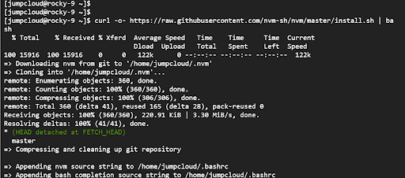

Running either of the above commands downloads and runs the nvm script. The script clones the nvm repository to the ~/.nvm directory in the user’s home directory. It also appends the nvm and bash_completion source string lines to the ~/.bashrc file.

Be sure to source the ~/.bashrc file.
```bash
$ source ~/.bashrc
```
NVM is installed per user and called per-shell. To start using NVM you need to start another shell or close and open another terminal shell session.

# Step 2: Install Node.js 20 on Rocky Linux 9 or RHEL 9
Once you’ve started a new shell session, run the following command to install the latest version of Node:

```bash
$ nvm install node
```
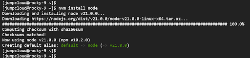
From the output, you can see that we have installed Node version 21.0.0 which is the current latest version at the time of writing this guide. To verify the version installed, run the command:

```bash
$ node –version
```
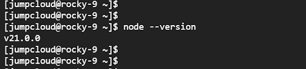
To install a specific version of Node, append the node version number. For example, to install Node 20, which is the upcoming LTS release, run the command:

```bash
$ nvm install node 18
```
To install the current LTS release, run the command:
```bash
$ nvm install –lts
```
In this case, the command installs Node.js v22.8.0 which is currently the latest LTS release.
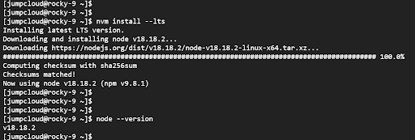

# Step 3: How to Manage Different Node.js Versions

So far, we’ve seen how to install different versions of Node.js. As mentioned earlier, different projects might require different versions of Node.js. 

To check the current installed Node.js versions, run the command:
```bash
$ nvm ls
```

You will get the following output that shows the current enabled version (appearing in green and indicated with a green arrow) and the default version. In addition, a list of previous LTS releases will also be displayed.

From the output below, the current active release is Node.js v20.8.1 and the default version is v21.0.0.

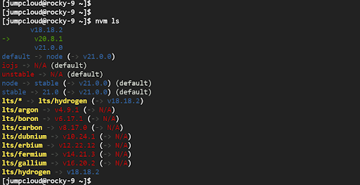
You can easily switch from one version to another. For example, to switch to Node 18, run the command:
```bash
$ nvm use 18
```
Again, you can confirm the current version of Node.js as shown.
```bash
$ node -v
```
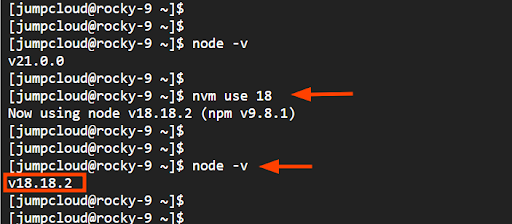

To set Node 20 as the default Node.js version, run the command:
```bash
$ nvm alias default 20
```
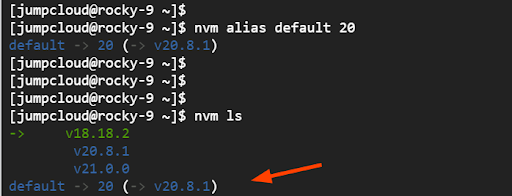
# Step 4: Create a Sample Node.js Application (Optional)
With Node.js installed, let’s now create a Node.js application. For illustration, we will create a simple ‘Hello World’ application.


Note: You will need access to firewall configuration for port 3000 to execute this example as written.
On the terminal, create an empty JS file using the Vim editor.

```bash
$ vim my_helloworld_app.js
```
Paste the following lines of code. The application will listen on port 3000 as specified by the const port directive.

```bash
const http = require(‘http’);
const hostname = ‘0.0.0.0’;
const port = 3000;
const server = http.createServer((req, res) => {
  res.statusCode = 200;
  res.setHeader(‘Content-Type’, ‘text/plain’);
  res.end(‘Hello World! The Node.JS application is working!’);
});
server.listen(port, hostname, () => {
  console.log(`Server running at http://${hostname}:${port}/`);
});
```
Save the changes and exit the file. Next, configure the firewall to open port 3000 for HTTP traffic.
```bash
$ sudo firewall-cmd --zone=public --add-port=3000/tcp --permanent
```
```bash
$ sudo firewall-cmd --reload
```
Then run the Node application as shown.

```bash
$ node my_helloworld_app.js
```
You will get a one-line output: server running at http://0.0.0.0:3000
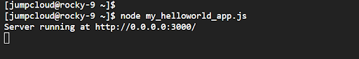

You can confirm that the application is running by browsing the URL shown.

```bash
http://server-ip:3000
```
# Step 5: Run the Node.js Application in the Background
The Node.js application we created only runs in the foreground. If you press CTRL + C, the application is terminated. In this section, we will show you how to run it in the background and free up the terminal.

To achieve this, we will use the pm2 global NPM module. PM2, an acronym for process manager, is a production-ready Node.js process manager. It provides key functionalities such as keeping applications running without interruption and reloading them with zero downtime. It also handles other aspects such as application monitoring, load balancing, logging, and clustering.

To get started with the pm2 module, install it by running the following command:
```bash
$ npm install -g pm2 
```
The command yields the following output:
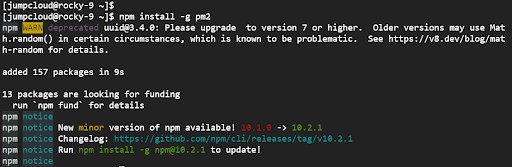
Next, set up the module to start on boot.

```bash
$ pm2 startup
```
The following output will be displayed with basic instructions for managing an application:

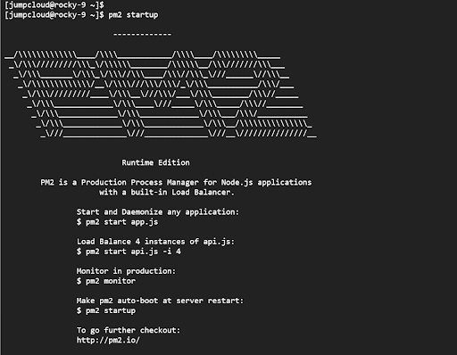
Now, lets start and daemonize our application and set it to run silently in the background.

```bash
$ pm2 start my_helloworld_app.js
```
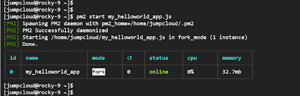
To save the configurations made, run the command:
```bash
$ pm2 save
```
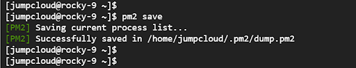
For additional information about the pm2 module, visit the pm2 official site.

# Closing thoughts
In this step-by-step tutorial, we demonstrated how to install Node.js 20 on Rocky Linux 9 or RHEL 9. We also went a step further and showed you how to install various versions of Node, and how to manage them. We then created a sample JavaScript application and managed a few of its operations using the pm2 module.

If you’d like to develop more Rocky Linux or RHEL 9 skills, check out the following tutorials:

['https://jumpcloud.com/blog/how-to-install-php-8-rhel-9']

['https://jumpcloud.com/blog/how-to-manage-software-packages-rocky-linux']

['https://jumpcloud.com/blog/how-to-install-mariadb-rhel-9']

['https://jumpcloud.com/blog/how-to-configure-secure-ssh-server-rocky-linux']